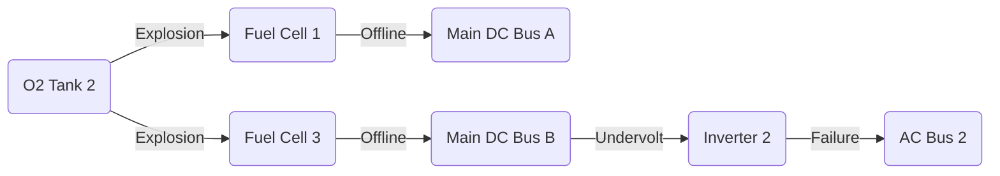

import { Callout, Steps, Step } from "nextra-theme-docs";

# Loss of Fuel Cells and AC Bus 2

The Apollo 13 accident led to the loss of two fuel cells and one of the two AC busses, severely crippling the spacecraft's power system. This section will explain the sequence of events that caused these critical components to fail and the immediate consequences for the mission.

## Oxygen Tank Explosion

The root cause of the fuel cell and AC bus failure was an explosion in one of the spacecraft's oxygen tanks. The Apollo Service Module had two oxygen tanks, labeled O2 Tank 1 and O2 Tank 2, which stored liquid oxygen used by the fuel cells to generate electricity and produce water.

<Callout type="info">
The oxygen tanks were pressurized to about 900 psi and maintained at a temperature of -297°F (-183°C) to keep the oxygen in a liquid state.
</Callout>

At approximately 55 hours and 54 minutes into the mission, the crew heard a loud bang and felt a vibration. Moments later, warning lights indicated a problem with the electrical system. It was later determined that O2 Tank 2 had exploded due to a short circuit in its wiring, causing a rapid loss of pressure and oxygen.

## Loss of Fuel Cell 1 and 3

The explosion in O2 Tank 2 led to the immediate loss of Fuel Cell 1 and Fuel Cell 3, which were connected to the oxygen supply from that tank. Fuel cells require a steady flow of oxygen and hydrogen to generate electricity through an electrochemical reaction. Without a stable oxygen supply, Fuel Cell 1 and 3 shut down, leaving only Fuel Cell 2 operational.

<Steps>
### Step 1

Fuel Cell 1 and 3 lose oxygen supply from O2 Tank 2 due to the explosion.

### Step 2

Without a stable oxygen supply, Fuel Cell 1 and 3 shut down, unable to generate electricity.

### Step 3

The spacecraft is left with only Fuel Cell 2 operational, powered by the remaining oxygen in O2 Tank 1.
</Steps>

## Main Bus B Undervolt and Loss of AC Bus 2

The loss of Fuel Cell 1 and 3 had an immediate impact on the spacecraft's electrical distribution system. Fuel Cell 1 was connected to [Main DC Bus A](/command-module-power-system/dc-ac-busses), while Fuel Cell 3 was connected to [Main DC Bus B](/command-module-power-system/dc-ac-busses). With both fuel cells offline, Main Bus B experienced an undervolt condition, meaning its voltage dropped below the nominal level.

<Callout type="warning">
The crew reported a "Main B Bus Undervolt" warning light, indicating that Main DC Bus B had lost power.
</Callout>

The undervolt on Main DC Bus B caused [Inverter 2](/command-module-power-system/inverters), which was powered by that bus, to fail. Inverter 2 was responsible for generating AC power for [AC Bus 2](/command-module-power-system/dc-ac-busses). As a result, AC Bus 2 went offline, leading to the loss of several critical components connected to that bus, including some telemetry sensors.

The loss of Fuel Cell 1, Fuel Cell 3, and AC Bus 2 put the Apollo 13 mission in a critical situation, forcing the crew and mission control to work together to diagnose the problem and find a solution to bring the astronauts home safely.