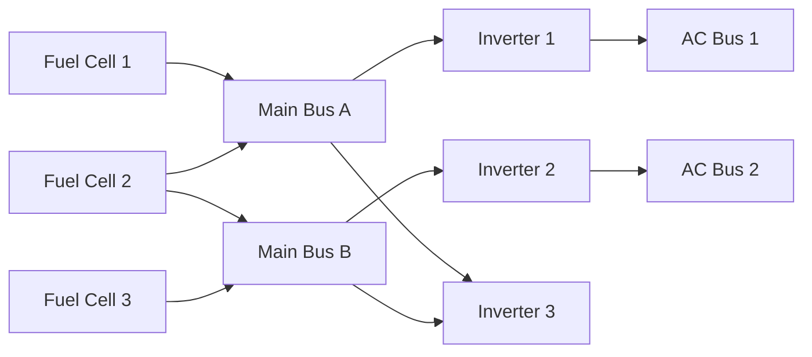

import { Callout, Steps, Step } from "nextra-theme-docs";

# DC and AC Busses

The Apollo Command Module's power distribution system consists of both Direct Current (DC) and Alternating Current (AC) busses. These busses are responsible for distributing electrical power from the fuel cells and batteries to various spacecraft systems and components.

## Main DC Busses

The Main DC Bus A and Main DC Bus B are the primary distribution points for DC power in the Command Module. Normally, Fuel Cell 1 powers Main Bus A, Fuel Cell 3 powers Main Bus B, and Fuel Cell 2 is connected to either A, B, or both, as a backup.

<Callout type="info">
  The Main DC Busses are connected to the fuel cells via thick conductors, ensuring reliable power distribution.
</Callout>

In case of a fuel cell failure, the astronauts can manually switch any fuel cell to any bus, providing flexibility in power management.

## AC Busses

The spacecraft has two AC busses, AC Bus 1 and AC Bus 2, which are powered by three [inverters](/command-module-power-system/inverters). The inverters convert the DC power from the fuel cells to 115 Volts, 400 Hz, 3-phase AC power.

<Steps>
### Inverter-to-AC Bus Configuration

1. Inverter 1 is powered by Main Bus A and can be connected to AC Bus 1 or AC Bus 2.
2. Inverter 2 is powered by Main Bus B and can be connected to AC Bus 1 or AC Bus 2.
3. Inverter 3 is powered by either Main Bus A or Main Bus B and can be connected to AC Bus 1 or AC Bus 2.

</Steps>

In the normal configuration, Inverter 1 powers AC Bus 1, Inverter 2 powers AC Bus 2, and Inverter 3 is on standby, connected to nothing.

<Callout type="warning">
  Unlike fuel cells, which can be connected to the same DC bus simultaneously, only one inverter can be connected to an AC bus at a time due to phase synchronization issues.
</Callout>

However, the system allows for flexibility in connecting any inverter to any AC bus if needed. A complicated set of motorized relays implements automatic interlocks, preventing the connection of more than one inverter to the same AC bus at a time.

By understanding the DC and AC power distribution system, engineers can better diagnose and troubleshoot issues related to the spacecraft's electrical system, as demonstrated during the [Apollo 13 accident](/apollo-13-accident).