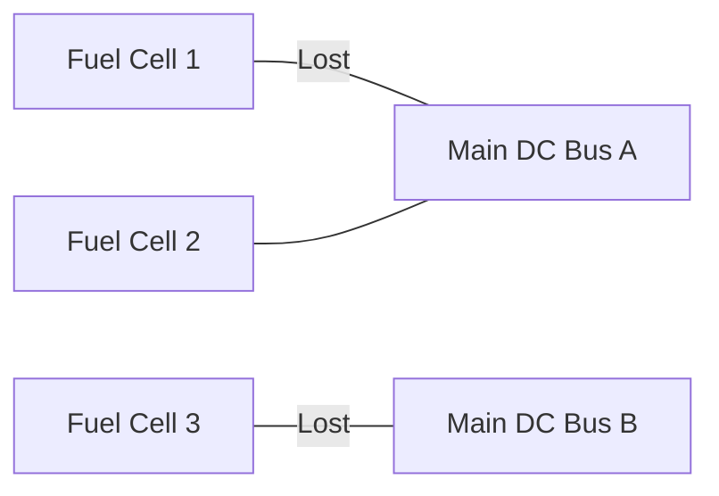

import { Callout, Steps, Step } from "nextra-theme-docs";

# Fuel Cells

The heart of the Apollo Command Module's electrical system consisted of three fuel cells, which produced electricity by reacting oxygen and hydrogen stored in liquid cryogenic form. This process not only generated power but also provided drinkable water for the astronauts.

<Callout>
Fuel cells were quite powerful, with a maximum rating of 1.42 kW each. The entire mission could run on only two fuel cells, and NASA stated that a mission could be successfully terminated using just one fuel cell.
</Callout>

The fuel cells produced power for the entire spacecraft in the form of DC voltage, varying from 27V to 31V, depending on the load. The power was distributed through thick conductors called busses: Main DC Bus A and Main DC Bus B.

## Fuel Cell Configuration

<Steps>

### Step 1
Under normal conditions, Fuel Cell 1 powered Main Bus A, Fuel Cell 3 powered Main Bus B, and Fuel Cell 2 served as a backup, connected to either A, B, or both.

### Step 2
In the event of a fuel cell failure, the crew could manually switch any fuel cell to any bus to maintain power.

</Steps>

## Fuel Cell Failure on Apollo 13

During the Apollo 13 mission, the famous "Main B Bus undervolt" call was made when Fuel Cell 1 and 3 were lost. At the time of the accident, the backup Fuel Cell 2 was connected to Bus A, resulting in only the Bus B voltage dropping to zero, triggering the Main Bus B Undervolt caution light.

The crew attempted to reconnect the fuel cells to the default configuration (Fuel Cell 1 to Main A, Fuel Cell 3 to Main B) but were unsuccessful, as both fuel cells had already failed.

<Callout>
After the Apollo 13 accident, a 400 amp-hour battery backup was added to Fuel Cell 2 on subsequent missions to provide additional redundancy in case of fuel cell failures.
</Callout>

The fuel cells played a critical role in the Apollo electrical system, and their failure on Apollo 13 was a major contributor to the crisis. Understanding the fuel cell system is essential for comprehending the [AC power generation](/command-module-power-system/inverters) and the overall [debugging process during the accident](/apollo-13-accident/debugging-by-mission-control).