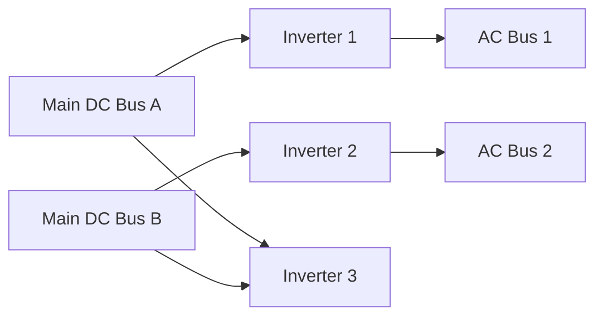

import { Callout, Steps, Step } from "nextra-theme-docs";

# Inverters

The Apollo Command Module had three inverters responsible for converting DC power from the fuel cells to AC power for the spacecraft. These inverters were crucial components of the electrical system, providing the necessary 115 Volt RMS, 400 Hz, 3-phase AC power for various systems and instruments onboard.

## Inverter Specifications

Each inverter was rated at 1.25 kW and was designed to operate efficiently under the demanding conditions of spaceflight. The inverters were solid-state devices, utilizing thyristors (SCRs), buck converters, and magnetic amplifiers to achieve the desired power conversion.

<Callout type="info">
The final upvoltage conversion was performed by rotating magnetic fields in a specially wound transformer, resulting in a heavy but efficient power unit due to the extensive use of magnetics.
</Callout>

## Inverter Configuration

The three inverters were connected to the spacecraft's power system in the following manner:

- Inverter 1: Powered by Main DC Bus A, output connected to AC Bus 1
- Inverter 2: Powered by Main DC Bus B, output connected to AC Bus 2
- Inverter 3: Powered by either Main DC Bus A or Main DC Bus B, on standby

<Callout type="warning">
Unlike the fuel cells, which could be connected to the same DC bus simultaneously, only one inverter could be connected to an AC bus at a time due to phase synchronization issues.
</Callout>

## Inverter Flexibility

Despite the default configuration, the inverters offered flexibility in connecting to the AC busses:

<Steps>
### Step 1

Any inverter could be connected to either AC Bus 1 or AC Bus 2, providing redundancy in case of inverter failure.

### Step 2

A complicated set of motorized relays implemented automatic interlocks, preventing the connection of more than one inverter to the same AC bus simultaneously.
</Steps>

This flexibility proved crucial during the [Apollo 13 accident](/apollo-13-accident), when the mission control team had to reconfigure the inverters to diagnose the extent of the damage to the spacecraft's power system.

By understanding the role and functionality of the inverters in the Apollo Command Module's electrical system, we can better appreciate the challenges faced by the mission control team during the Apollo 13 accident and the importance of their quick thinking and expertise in saving the mission.